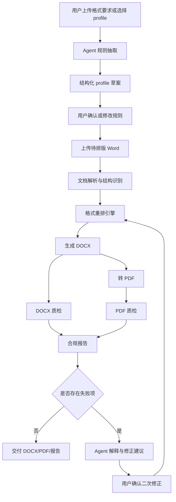
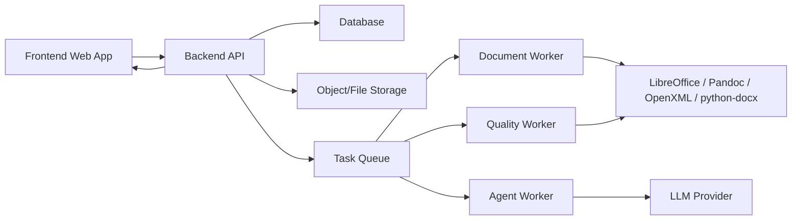

# Word 论文格式规范化 Web 工具产品方案

## 1. 产品定位

本产品是一个面向论文、报告、课题材料、单位规范文档的 Word 格式自动规范化工具。用户上传待排版 Word 文件，同时选择已有格式模板 profile，或上传格式要求文档、输入自然语言格式规则，由 Agent 自动拆解规则、生成结构化 profile，再由确定性的文档排版引擎执行格式重排，最终输出符合要求的 DOCX、PDF 和格式质检报告。

产品核心不是简单的“套模板”，而是形成一套可解释、可复用、可质检、可迭代的文档格式处理流程：

1. 规则理解：把自然语言或格式要求文档拆成机器可执行的格式 profile。
2. 结构识别：识别输入 Word 中的标题、摘要、正文、图表、公式、参考文献、页眉页脚等结构。
3. 确定性重排：使用 OpenXML、python-docx、Pandoc、LibreOffice 等工具链执行格式化。
4. 自动质检：检查输出文档是否满足 profile。
5. Agent 修正：对不确定项和失败项进行解释、建议、二次修复。

## 2. 核心结论

可以做成前后端分离 Web 工具，并且 Agent 很适合参与规则拆解、结构识别辅助、异常解释和修正建议。

但产品设计上不应让 Agent 直接“随意改 Word”。Word 格式处理必须采用“Agent 决策 + 规则引擎执行 + 自动质检闭环”的架构。Agent 负责把模糊需求变成结构化规则和修正计划，真正落地格式修改的动作由确定性文档引擎完成。

建议产品承诺为：

- 对结构清晰、常规论文类 Word，自动规范化目标达到高稳定可交付。
- 对结构混乱、图片公式、手动目录、文本框、乱分节、浮动图表等复杂文档，输出规范化结果并给出明确质检报告，标注需要人工确认的问题。
- 不承诺任意输入文件 100% 无人工校对，但尽量把人工工作从“全文逐页排版”压缩为“处理少量红黄灯问题”。

## 3. 目标用户与使用场景

### 3.1 目标用户

- 本科、硕士、博士论文作者。
- 课题组、实验室、学院教学秘书。
- 需要批量整理 Word 材料的行政、科研、企业文档人员。
- 需要统一格式输出报告、标书、制度文件的团队。

### 3.2 典型场景

1. 学校论文格式规范化  
   用户上传论文初稿，选择“华东师范大学毕业论文格式” profile，一键生成规范 DOCX 和 PDF。

2. 从格式要求文档生成模板  
   用户上传学校发布的“论文格式要求.doc/docx/pdf”，Agent 自动拆成页面、字体、标题、摘要、图表、参考文献等规则，用户确认后保存为新 profile。

3. 自然语言定义格式  
   用户输入“正文宋体小四，1.5 倍行距，一级标题黑体四号居中，页边距上 2.5cm 下 2.0cm 左 3.0cm 右 2.5cm”，系统生成可执行 profile。

4. 批量格式检查  
   用户上传多个 Word，系统不一定重排，只输出格式合规报告，适合导师、学院、项目负责人快速筛查。

5. Agent 逐项修正  
   系统发现“第 3 页疑似二级标题未套用标题样式”“表 2 缺英文表题”“参考文献第 7 条年份缺失”，用户可以点击“让 Agent 修正”或手动确认。

## 4. 产品目标

### 4.1 MVP 目标

第一版先把一个闭环跑稳：

- 支持上传 `.doc`、`.docx`。
- 支持选择已有 profile。
- 支持从自然语言生成 profile 草案。
- 支持从格式要求 Word 中抽取格式规则草案。
- 支持生成规范化 DOCX。
- 支持 DOCX 转 PDF。
- 支持输出格式检查报告。
- 支持用户在 Web 页面查看规则、修改规则、重新执行。
- 内置一个“华东师范大学毕业论文格式”示例 profile。

### 4.2 非 MVP 目标

以下能力建议第二阶段再做：

- 多文档批量处理。
- 支持复杂模板封面自动填充。
- 支持 GB/T 7714 参考文献自动重排。
- 支持图表自动编号和交叉引用。
- 支持公式 OCR 或截图公式重建。
- 支持在线预览逐页比对。
- 支持多人协作、组织模板库和权限管理。

## 5. 产品原则

1. 规则可解释  
   Agent 拆出来的所有格式规则必须展示给用户确认，不能黑箱执行。

2. 执行可复现  
   每次排版任务必须绑定 profile 版本、输入文件 hash、工具链版本和执行日志。

3. 修改可追溯  
   输出报告要说明哪些格式被修改、哪些问题无法自动判断、哪些项需要用户确认。

4. Agent 不直接破坏文档  
   Agent 只产出结构化规则、修正计划、解释文本。实际 DOCX 修改由确定性文档工具执行。

5. 可失败但不能假装成功  
   检查不通过时要明确输出失败项，不把“生成了文件”等同于“格式完全合规”。

6. 保留可编辑结果  
   正式中文长文档默认走 `DOCX 可编辑稿 + PDF 交付稿 + 检查报告`。

## 6. 总体工作流



## 7. 功能模块

### 7.1 账号与项目空间

MVP 可以先不做复杂账号体系，但建议保留项目空间概念。

一个项目包含：

- 输入文档。
- 使用的 profile。
- 规则确认记录。
- 排版任务记录。
- 输出文件。
- 质检报告。
- Agent 对话与修正记录。

### 7.2 Profile 管理

Profile 是产品的核心资产。每一个 profile 代表一套可复用的格式规范。

Profile 来源：

- 系统内置。
- 用户手动创建。
- 从自然语言生成。
- 从格式要求文档生成。
- 从示例 Word 模板反推。

Profile 状态：

- `draft`：Agent 生成但未确认。
- `active`：可用于排版。
- `archived`：历史版本，不推荐继续使用。

Profile 版本：

- 每次修改规则生成新版本。
- 排版任务必须绑定具体版本，不能只绑定 profile 名称。

### 7.3 规则抽取 Agent

输入：

- 格式要求文档正文。
- 示例模板 Word 结构。
- 用户自然语言描述。

输出：

- 结构化 profile 草案。
- 不确定规则列表。
- 需要用户确认的问题。

Agent 拆解维度：

- 页面设置。
- 正文字体与段落。
- 标题层级。
- 摘要与关键词。
- 目录。
- 页眉页脚与页码。
- 图题、表题、公式。
- 表格样式。
- 参考文献。
- 注释、脚注、尾注。
- 封面与声明页。
- 附录。

### 7.4 Profile 可视化编辑器

用户不应直接编辑 YAML。Web 端需要提供结构化表单：

- 页面尺寸、方向、页边距。
- 中文字体、英文字体、字号、行距。
- 标题层级样式。
- 目录生成规则。
- 页码位置与编号格式。
- 图表题注规则。
- 公式排版规则。
- 参考文献样式。
- 检查强度。

同时提供高级模式，允许导入/导出 `profile.yaml`。

### 7.5 Word 文档解析器

负责读取输入 Word，并生成中间结构表示。

解析内容：

- 段落文本、样式、字体、字号、缩进、行距。
- 标题候选与层级。
- 表格位置、行列结构、边框。
- 图片位置、尺寸、环绕方式。
- 题注候选。
- 公式对象和疑似公式文本。
- 脚注、尾注、引用。
- 页眉页脚。
- 分节符和分页符。
- 目录字段。

对 `.doc` 输入先转为 `.docx` 再处理。

### 7.6 结构识别 Agent

Word 文档经常没有正确使用样式。结构识别 Agent 用于辅助判断：

- 哪些段落是一级、二级、三级标题。
- 哪些内容属于中文摘要、英文摘要、关键词。
- 哪些段落是参考文献条目。
- 哪些文本是图题、表题。
- 哪些编号是标题编号，哪些只是正文编号。

Agent 输出不直接修改文档，而是生成结构标注建议。系统可根据置信度自动应用，也可让用户确认。

### 7.7 格式重排引擎

格式重排引擎是确定性执行层。

职责：

- 应用页面设置。
- 设置全局默认字体和段落。
- 套用标题样式。
- 生成或修正目录。
- 设置页眉页脚和页码。
- 规范正文段落。
- 规范摘要、关键词。
- 规范表格为三线表或 profile 指定样式。
- 规范图题表题。
- 设置公式段落居中、字体、斜体等规则。
- 规范参考文献段落缩进与编号。
- 清理多余空段、异常空白页、手动空格式缩进。

推荐技术路线：

- `python-docx`：处理中低复杂度段落、样式、表格。
- 直接 OpenXML：处理分节、页眉页脚、目录字段、复杂编号、样式定义。
- LibreOffice headless：`.doc` 转 `.docx`、DOCX 转 PDF。
- Pandoc：Markdown 规则文档、结构化内容生成 DOCX 时使用。

### 7.8 质检引擎

质检必须独立于重排引擎，避免“自己改、自己说通过”的偏差。

检查项：

- 页面尺寸、方向、页边距。
- 正文字体、字号、行距、首行缩进。
- 标题样式、层级、编号。
- 目录是否存在、是否可更新。
- 页码位置和格式。
- 图题是否位于图下方。
- 表题是否位于表上方。
- 表格边框是否符合三线表。
- 公式是否独立成行、是否残留 LaTeX 源码。
- 参考文献格式是否满足基础规则。
- PDF 页数是否正常。
- PDF 文本是否可抽取。
- 是否存在明显空白页。

检查结果分级：

- `pass`：明确通过。
- `fixed`：发现问题并已自动修复。
- `warning`：可能不合规，需要用户确认。
- `fail`：未满足规则，且自动修复失败。
- `unsupported`：当前工具链无法判断。

### 7.9 Agent 修正闭环

当质检出现 warning 或 fail 时，Agent 参与解释和修正：

- 解释失败原因。
- 判断是否可以自动修。
- 生成修正计划。
- 调用格式重排引擎再次执行。
- 更新报告。

示例：

```text
问题：检测到 3 个表格不是三线表。
原因：原文档表格存在全框线和内部竖线。
建议：按 profile 的三线表规则保留顶线、表头下线、底线，移除内部竖线。
操作：可自动修复。
```

## 8. 前后端分离架构

### 8.1 总体架构



### 8.2 前端

推荐技术栈：

- React + TypeScript。
- Vite 或 Next.js。
- Zustand 或 TanStack Query 管理状态。
- shadcn/ui 或其他组件库。

核心页面：

1. 首页工作台  
   展示最近项目、快速上传、profile 列表。

2. Profile 管理页  
   创建、导入、编辑、版本管理、设为默认。

3. 规则抽取页  
   上传格式要求文档或输入自然语言，展示 Agent 拆解结果。

4. 文档排版任务页  
   上传待排版文档、选择 profile、启动任务、查看进度。

5. 质检报告页  
   展示通过项、修复项、警告项、失败项，并支持逐项修正。

6. 输出下载页  
   下载 DOCX、PDF、报告、profile。

### 8.3 后端

推荐技术栈：

- FastAPI。
- PostgreSQL。
- Redis + RQ/Celery/Arq。
- 本地文件存储或 S3 兼容对象存储。
- Python 文档处理环境使用独立 venv 或 uv 管理。

后端职责：

- 文件上传与安全校验。
- Profile CRUD。
- 排版任务编排。
- Agent 调用。
- 文档转换与格式化。
- 质检执行。
- 输出文件管理。
- 日志与任务状态推送。

### 8.4 Worker

建议拆分三类 worker：

1. Agent Worker  
   执行规则抽取、结构识别、失败项解释、修正计划生成。

2. Document Worker  
   执行 `.doc -> .docx`、OpenXML 修改、DOCX 生成、PDF 导出。

3. Quality Worker  
   执行 DOCX/PDF 检查，生成报告。

这样可以避免长任务阻塞 API，并方便后续扩展批量处理。

## 9. Profile 数据结构设计

### 9.1 示例结构

```yaml
id: ecnu_thesis
name: 华东师范大学毕业论文格式
version: 1.0.0
status: active
locale: zh-CN

page:
  size: A4
  orientation: portrait
  margins:
    top_cm: 2.5
    bottom_cm: 2.0
    left_cm: 3.0
    right_cm: 2.5
  gutter:
    position: left

fonts:
  default_zh: 宋体
  default_en: Times New Roman
  headings_zh: 黑体
  fallback:
    - SimSun
    - Songti SC
    - Noto Serif CJK SC

body:
  font_zh: 宋体
  font_en: Times New Roman
  size_pt: 12
  line_spacing: 1.5
  first_line_indent_chars: 2
  alignment: justified

headings:
  h1:
    numbering: chinese_level_1
    font_zh: 黑体
    size_pt: 12
    bold: false
    alignment: left
    standalone: true
    spacing_before_pt: 12
    spacing_after_pt: 6
  h2:
    numbering: chinese_parenthesized
    font_zh: 黑体
    size_pt: 12
    alignment: left
    standalone: true
  h3:
    numbering: decimal
    font_zh: 黑体
    size_pt: 12
    alignment: left
    inline_allowed: true

abstract:
  zh:
    title: 摘要
    font_zh: 宋体
    size_pt: 10.5
    word_count_range: [300, 500]
  en:
    title: Abstract
    font_en: Times New Roman
    size_pt: 10.5
    word_count_range: [300, 500]

toc:
  required: true
  source: heading_styles
  title: 目录
  update_fields: true

page_numbers:
  enabled: true
  position: footer_center
  format: arabic

tables:
  caption:
    position: above
    bilingual: true
  style:
    type: three_line
    remove_vertical_borders: true

figures:
  caption:
    position: below
    bilingual: true
  size_rules:
    half_width_max_mm: 60
    full_width_min_mm: 100
    full_width_max_mm: 130

equations:
  standalone: true
  alignment: center
  italic: true
  forbid_raw_latex_in_output: true

references:
  required: true
  min_total:
    liberal_arts: 10
    others: 6
  min_foreign: 2
  order: citation_order

quality:
  fail_on_raw_latex: true
  fail_on_missing_page_number: true
  warn_on_unrecognized_heading: true
  warn_on_image_equation: true
```

### 9.2 Profile 设计原则

Profile 要做到：

- 人能读。
- 机器能执行。
- 可版本化。
- 可局部覆盖。
- 可生成质检规则。
- 可从 Agent 抽取结果映射而来。

不要把 profile 写成单纯的提示词。它应该是确定性配置，而不是自然语言说明。

## 10. API 设计

### 10.1 文件上传

```http
POST /api/files
Content-Type: multipart/form-data
```

返回：

```json
{
  "file_id": "file_123",
  "filename": "thesis.docx",
  "mime_type": "application/vnd.openxmlformats-officedocument.wordprocessingml.document",
  "size": 1024000
}
```

### 10.2 创建 profile 抽取任务

```http
POST /api/profile-extractions
```

请求：

```json
{
  "source_type": "document",
  "file_id": "file_123",
  "natural_language": null
}
```

返回：

```json
{
  "job_id": "job_123",
  "status": "queued"
}
```

### 10.3 获取 profile 抽取结果

```http
GET /api/profile-extractions/{job_id}
```

返回：

```json
{
  "status": "completed",
  "profile_draft": {},
  "uncertain_items": [
    {
      "field": "headings.h1.size_pt",
      "message": "格式要求中只写了各段标题黑体小四，未明确一级标题是否例外。",
      "suggestion": "按黑体小四处理。"
    }
  ]
}
```

### 10.4 保存 profile

```http
POST /api/profiles
```

请求：

```json
{
  "name": "华东师范大学毕业论文格式",
  "profile": {},
  "status": "active"
}
```

### 10.5 创建排版任务

```http
POST /api/format-jobs
```

请求：

```json
{
  "input_file_id": "file_456",
  "profile_id": "ecnu_thesis",
  "profile_version": "1.0.0",
  "options": {
    "generate_pdf": true,
    "generate_report": true,
    "auto_fix": true
  }
}
```

返回：

```json
{
  "job_id": "job_456",
  "status": "queued"
}
```

### 10.6 获取排版任务状态

```http
GET /api/format-jobs/{job_id}
```

返回：

```json
{
  "job_id": "job_456",
  "status": "quality_checking",
  "progress": 75,
  "current_step": "正在检查图表题注"
}
```

### 10.7 获取输出文件

```http
GET /api/format-jobs/{job_id}/outputs
```

返回：

```json
{
  "docx_file_id": "file_out_docx",
  "pdf_file_id": "file_out_pdf",
  "report_file_id": "file_out_report"
}
```

### 10.8 请求 Agent 修正

```http
POST /api/format-jobs/{job_id}/agent-fixes
```

请求：

```json
{
  "issue_ids": ["issue_1", "issue_2"],
  "instruction": "能自动修的都修，参考文献只标注问题不要改内容。"
}
```

返回：

```json
{
  "fix_job_id": "job_fix_123",
  "status": "queued"
}
```

## 11. 数据库设计草案

### 11.1 profiles

- `id`
- `name`
- `description`
- `status`
- `created_at`
- `updated_at`

### 11.2 profile_versions

- `id`
- `profile_id`
- `version`
- `profile_yaml`
- `source_type`
- `source_file_id`
- `created_by_agent`
- `created_at`

### 11.3 files

- `id`
- `filename`
- `mime_type`
- `size`
- `sha256`
- `storage_path`
- `created_at`

### 11.4 jobs

- `id`
- `type`
- `status`
- `progress`
- `current_step`
- `input_payload`
- `output_payload`
- `error_message`
- `created_at`
- `updated_at`

### 11.5 quality_reports

- `id`
- `job_id`
- `summary`
- `report_json`
- `report_markdown_file_id`
- `created_at`

### 11.6 agent_messages

- `id`
- `job_id`
- `role`
- `content`
- `metadata`
- `created_at`

## 12. Agent 设计

### 12.1 Agent 类型

建议拆成 4 个 Agent，而不是一个万能 Agent：

1. Rule Extraction Agent  
   从格式要求中抽取 profile。

2. Document Structure Agent  
   辅助识别输入 Word 的结构。

3. Quality Explanation Agent  
   解释质检问题，给出用户能理解的原因。

4. Fix Planning Agent  
   把失败项转成确定性工具可执行的修正计划。

### 12.2 Agent 输出格式

Agent 输出必须是结构化 JSON/YAML，不允许只输出自然语言。

示例：

```json
{
  "action": "apply_table_style",
  "target": {
    "table_indices": [1, 2, 3]
  },
  "parameters": {
    "style": "three_line",
    "remove_vertical_borders": true
  },
  "confidence": 0.93,
  "requires_user_confirmation": false
}
```

### 12.3 Agent 安全边界

Agent 不允许：

- 直接写入最终 DOCX。
- 删除正文内容。
- 修改论文语义。
- 擅自改参考文献条目信息。
- 擅自改公式内容。
- 在用户未确认时重写标题层级中的低置信度项。

Agent 可以：

- 标注结构。
- 解释问题。
- 建议修正。
- 调用白名单工具。
- 生成 profile。
- 生成检查报告摘要。

## 13. 文档处理技术路线

### 13.1 输入支持

MVP 支持：

- `.doc`
- `.docx`
- `.md`，用于规则描述或后续扩展。
- `.pdf`，只用于规则要求读取，不建议第一版支持 PDF 论文重排。

### 13.2 DOC 转 DOCX

旧版 `.doc` 必须先使用 LibreOffice headless 转为 `.docx`。

```bash
soffice --headless --convert-to docx --outdir output input.doc
```

### 13.3 DOCX 修改

优先策略：

1. 对普通段落、字体、字号、行距、缩进、表格，使用 `python-docx`。
2. 对复杂 Word 特性，直接修改 OpenXML。
3. 对自动目录、字段、页眉页脚、分节符，优先 OpenXML。
4. 对最终 PDF，使用 LibreOffice 自动导出。

### 13.4 PDF 输出

使用本机约定工具：

```bash
codex-docx-to-pdf input.docx output_dir
```

### 13.5 检查工具

使用本机约定工具：

```bash
codex-docx-inspect input.docx
codex-pdf-inspect input.pdf
```

质检引擎可在这些基础工具之上扩展更细的 OpenXML 检查。

## 14. 质量评价指标

### 14.1 自动化指标

- 格式规则通过率。
- 自动修复成功率。
- 低置信度结构识别比例。
- 需要人工确认的问题数量。
- 生成失败率。
- 平均处理时长。

### 14.2 用户体验指标

- 用户从上传到拿到结果的时间。
- 用户需要手动处理的问题数量。
- 用户二次排版次数。
- profile 复用次数。
- 同一 profile 下批量文档通过率。

### 14.3 交付质量指标

- DOCX 可编辑性。
- PDF 页数正常。
- PDF 文本可抽取。
- 无明显空白页。
- 无 LaTeX 源码残留。
- 图表和公式未异常跨页。

## 15. 风险与应对

### 15.1 Word 输入不可控

风险：

- 手动空格缩进。
- 手动目录。
- 浮动图片。
- 文本框。
- 截图公式。
- 乱分节。
- 标题没有样式。

应对：

- 先做文档诊断。
- 输出结构识别置信度。
- 低置信度项交给用户确认。
- 用质检报告明确风险。

### 15.2 Agent 幻觉

风险：

- Agent 把格式要求理解错。
- Agent 编造不存在的规则。
- Agent 过度修改。

应对：

- Agent 输出必须附来源证据。
- 规则确认页要求用户确认。
- Profile 保存版本。
- 排版引擎只接受 schema 合法的规则。
- 质检引擎独立检查。

### 15.3 PDF 与 DOCX 表现不一致

风险：

- DOCX 在 Word 和 LibreOffice 中表现不同。
- 字体缺失导致分页变化。

应对：

- 固定字体 fallback。
- PDF 转换后检查页数和可抽取文本。
- 对正式交付文件保留 DOCX 和 PDF 双输出。
- 对特殊模板建议人工 Word 最终审阅。

### 15.4 复杂公式处理困难

风险：

- 截图公式无法自动重排。
- LaTeX 宏无法直接转换为 Office Math。

应对：

- 文本公式优先转换为 Office Math。
- 图片公式标为 warning。
- 禁止最终文档残留明显 LaTeX 源码。
- 复杂公式作为第二阶段增强。

## 16. MVP 里程碑

### 阶段 1：基础工程与 profile

- 建立前后端分离项目。
- 建立文件上传和任务系统。
- 建立 profile YAML schema。
- 内置 ECNU 论文格式 profile。
- 实现 profile 查看和编辑。

验收：

- 可以在 Web 页面创建、查看、修改、保存 profile。
- 可以上传格式要求文档并保存。

### 阶段 2：Word 解析与基础重排

- 支持 `.doc/.docx` 上传。
- `.doc` 自动转 `.docx`。
- 解析段落、标题、表格、图片、页眉页脚。
- 应用页面、字体、字号、行距、缩进、标题样式。

验收：

- 上传常规论文初稿后，可以生成初版规范 DOCX。

### 阶段 3：质检报告

- 实现 DOCX 基础格式检查。
- 实现 PDF 导出。
- 实现 PDF 页数、文本可抽取、空白页检查。
- 输出 Markdown/JSON 质检报告。

验收：

- 每个任务都有明确通过项、修复项、警告项、失败项。

### 阶段 4：Agent 规则抽取

- 从自然语言生成 profile 草案。
- 从格式要求 Word 抽取 profile 草案。
- 展示不确定项和来源证据。
- 用户确认后保存 profile。

验收：

- 上传“华东师范大学毕业论文格式要求.doc”后，能生成可编辑 profile 草案。

### 阶段 5：Agent 修正闭环

- 对质检失败项生成解释。
- 对可自动修复项生成修正计划。
- 用户确认后二次执行。
- 对不可自动修复项给出人工处理建议。

验收：

- 表格、标题、正文段落等常见问题能自动二次修复。

## 17. 第一版建议目录结构

```text
word-format-agent/
  backend/
    app/
      api/
      agents/
      core/
      document/
      profiles/
      quality/
      workers/
    tests/
    pyproject.toml
    .env.example
  frontend/
    src/
      pages/
      components/
      features/
      api/
      stores/
    package.json
  profiles/
    ecnu_thesis.yaml
  docs/
    product-plan.md
    profile-schema.md
    api.md
  storage/
    .gitkeep
```

## 18. 环境与配置原则

Python 依赖建议使用 `uv` 或 conda 独立环境，避免混用系统 Python、Homebrew Python 和全局 pip。

所有密钥和模型配置放入 `.env`：

```dotenv
# LLM 服务商 API Key，必填，用于 Agent 规则抽取和修正解释
LLM_API_KEY=

# LLM 模型名称，必填，可在不同供应商模型之间切换
LLM_MODEL=

# 数据库连接地址，开发环境可使用本地 PostgreSQL
DATABASE_URL=

# Redis 地址，用于异步任务队列
REDIS_URL=

# 文件存储目录，本地开发可使用相对路径 storage
FILE_STORAGE_ROOT=

# LibreOffice 可执行文件路径，默认可自动发现
SOFFICE_BIN=/opt/homebrew/bin/soffice
```

不要把 API Key、Token、模型密钥写死在代码里。

## 19. 验收标准

MVP 完成时，至少满足：

1. 前后端分离运行。
2. Web 端可以上传格式要求文档并生成 profile 草案。
3. Web 端可以编辑、保存、版本化 profile。
4. Web 端可以上传待排版 Word。
5. 后端可以根据 profile 生成规范化 DOCX。
6. 后端可以导出 PDF。
7. 系统可以生成质检报告。
8. Agent 可以解释质检失败项。
9. 常见正文、标题、页面、表格格式问题可以自动修复。
10. 输出中不会把“生成成功”误报为“全部合规”，报告必须列出未通过项。

## 20. 推荐产品形态

最稳的产品形态不是“承诺一键完美”，而是：

```text
一键排版 + 规则可确认 + 质检可解释 + Agent 逐项修正
```

这样可以让用户感受到自动化效率，同时保留对复杂 Word 文档的质量控制。第一版先围绕一个明确论文规范 profile 做深做稳，再扩展到多学校、多单位、多模板，是更可靠的路线。

